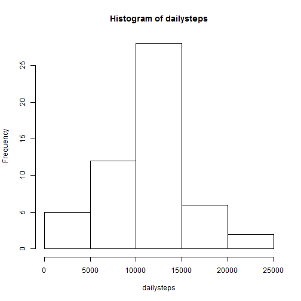
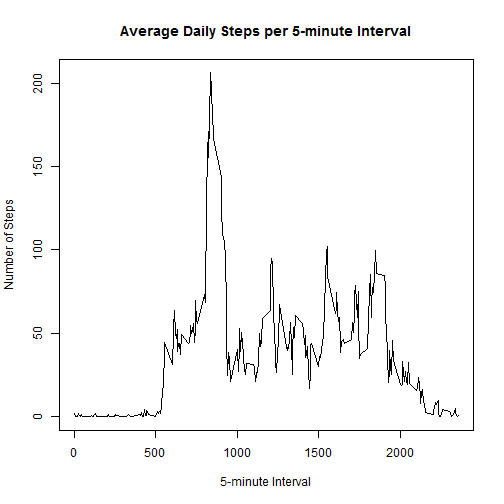
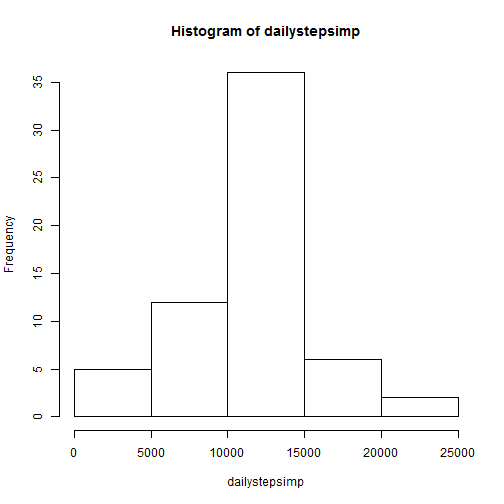
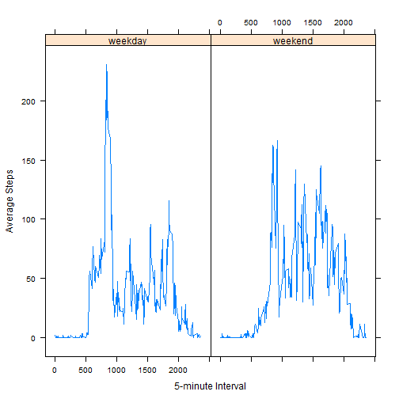

This file will perform and explain an analysis of data collected from a personal activity monitoring device.

The first step of the analysis is to load the data from the active working directory and change the date column to a date format:


```r
activity=read.csv("activity.csv")
activity$date=as.Date(activity$date)
```

## What is the mean total number of steps taken per day?  

The first plot will show a histogram of the total number of steps taken each day:  


```r
dailysteps=tapply(activity$steps,activity$date,FUN=sum)
hist(dailysteps)
```

 

```r
meansteps=as.integer(mean(dailysteps,na.rm=TRUE))
mediansteps=as.integer(median(dailysteps,na.rm=TRUE))
```

The mean number of steps over all days with steps is 10766.  The median number of steps
over all days with steps is 10765.  

## What is the average daily activity pattern?  

The second plot will average daily activity for each 5-minute interval of a day.  


```r
intervalsteps=aggregate(activity$steps,list(activity$interval),mean,na.rm=TRUE)
plot(intervalsteps,type="l",main="Average Daily Steps per 5-minute Interval",ylab="Number of Steps",xlab="5-minute Interval")
```

 

The next portion of code will identify which 5-minute interval contains the highest average number of steps:


```r
x=which.max(intervalsteps$x)
max=intervalsteps$Group.1[x]
```

The 5-minute interval with the highest average number of steps starts at 835.  

## Imputing missing values.  

A number of rows have missing values that need to be identified and imputed. The following code
will determine how many rows are missing a steps reading in the activity file.


```r
missing=nrow(activity)-sum(complete.cases(activity))
```

There are 2304 rows in the data set that are missing values.  
We will impute the missing steps values with the average number of steps for the respective
5-minute interval. The following code requires the 'plyr' and 'Hmisc' will add a new column to 
the data set that contains these imputed values:


```r
library(Hmisc)
library(plyr)
activity=ddply(activity,"interval",mutate,imputed.steps=impute(steps,mean))
activity$imputed.steps=as.numeric(activity$imputed.steps)
```

We will now recreate the previous histogram with the imputed values in the new dataset and
calculate the new mean and median:


```r
dailystepsimp=tapply(activity$imputed.steps,activity$date,FUN=sum)
hist(dailystepsimp)
```

 

```r
meanstepsimp=as.integer(mean(dailystepsimp))
medianstepsimp=as.integer(median(dailystepsimp))
```

With the imputed values, the mean number of steps over all days with steps is 10766.  
The median number of steps over all days with steps is 10766. This compares to the
previous mean of 10766 and median of 10765.

## Are there differences in activity patterns between weekdays and weekends?  

We will add a column to the activity data set that specifies whether the date is a weekend
or a weekday.  


```r
weekends=c("Saturday","Sunday")
activity=mutate(activity,weekend=ifelse(weekdays(date) %in% weekends,"weekend","weekday"))
activity$weekend=as.factor(activity$weekend)
```

The next section of code will create a summary table of average steps per 5-minute interval
for grouped by weekends and weekdays. It will then use the 'lattice' package to create two 
time-series plots to compare weekend activity to weekday activity:


```r
library(lattice)
wdintervalsteps=aggregate(activity$imputed.steps,list(activity$interval,activity$weekend),mean)
xyplot(x~Group.1 | Group.2, data=wdintervalsteps, type="l", ylab="Average Steps", xlab="5-minute Interval")
```

 
